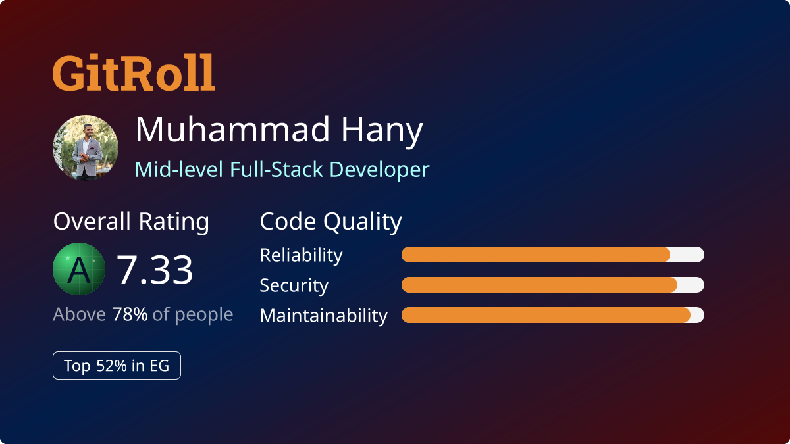

  

  
  
  

---

## 👋 About Me

I'm a **Full-Stack Engineer** specializing in **Next.js, TypeScript, and Firebase**, with deep experience shipping production systems across three verticals:

- 🚚 **A US-based logistics CRM** (client under NDA) — sole engineer, frontend → infra
- 🧩 **[mena-x.com](https://mena-x.com)** — my own multi-product SaaS suite with **10 live subdomains**
- 🪪 **[LinkedTrust](https://allskillscount.org)** — the verifiable-credentials ecosystem (W3C VC Data Model)

I've also contributed to large open-source AI projects like **camel-ai/camel** (17K ★) and **gpt-researcher** (27K ★), and I author tools like [`nextjs-mui-audit-toolkit`](https://github.com/dev-mhany).

> *My take: if an idea is imaginable, it can be built — and I treat that as a job description.*

| 🚀 Commits | 🔀 Merged PRs | 📦 Public Repos | 🌐 Live Projects |
|:---:|:---:|:---:|:---:|
| **4,950+** | **225+** *(~93% merge rate)* | **80** | **66 Vercel · 21 custom domains** |

---

## 🛠️ Tech Stack

#### Frontend

#### Backend & Cloud

#### AI, Maps & Verifiable Credentials

#### Testing & Tooling

---

## 💼 Selected Experience

### 🚚 US Auto-Shipping Logistics Platform &nbsp;·&nbsp; *Sole Full-Stack Engineer* &nbsp;·&nbsp; `Sep 2024 – Present`
> *Client under NDA — repos & live URLs available on request.*

- Sole engineer on a vehicle-shipping dispatch **CRM and its v2 rewrite** &nbsp;—&nbsp; **1,100+ commits** across both codebases.
- Built order handling, lead-list and provider filters, and **pricing / dispatch logic** powering carrier matching.
- Integrated **Mapbox** for route + image optimization; added **JSON-LD** structured data and a **dynamic city-based sitemap**.
- 📈 **10-month SEO impact (Google Search Console):**
  - Organic clicks &nbsp;**165 → 6.16k**&nbsp; *(37×)*
  - Impressions &nbsp;**4.95k → 872k**&nbsp; *(176×)*
  - Avg. ranking &nbsp;**#52 → #24**

### 🧩 MENA-X &nbsp;·&nbsp; *Founder & Solo Engineer* &nbsp;·&nbsp; `2024 – Present`
- Designed, built, and operate the **MENA-X SaaS suite** — **10 production subdomains** spanning CRM, restaurant QR menus, gym management, wedding-hall booking, multi-tenant legal SaaS, Business Model Canvas tooling, and a Google-Maps scraper.
- Built **UC Math**, a three-tier education platform: marketing, student app, admin dashboard.
- Custom-domain client sites: *Jetour Leopard accessories (UAE), a laser-cutting business, a robotics company, e-commerce, children's playgrounds.*
- Other shipped products: **Super-Access** (org-level session sharing without exposing credentials), **PharmSync**, **HR-Insights**.

### 🪪 LinkedTrust / T3 Innovation Network &nbsp;·&nbsp; *Frontend / Full-Stack Engineer* &nbsp;·&nbsp; `May 2024 – Mar 2026`
- **180+ merged PRs and 540+ commits** across LinkedCreds, Resume-Author, LinkedCreds-Business, and skillsaware-endorsement.
- Built credential & recommender flows end-to-end: **QR-code generation for verifiable credentials**, employment-credential flow, LinkedIn share prefilled with VC name, credential deletion across VCs / relations / media.
- Integrated a **Rich Text Editor** and **credential-overlay** into Resume-Author; added languages, work-experience, skills, and professional-affiliations sections; built **PDF download, preview pagination, and signed-resume QR**.
- Migrated credential retrieval to **Firebase**; integrated **Google Drive** (`auth/drive.readonly`); built email verification with paste handling.

---

## 🌟 Open-Source Contributions

| Project | Stars | Contribution |
|---|:---:|---|
| [`camel-ai/camel`](https://github.com/camel-ai/camel) | **17K ★** | Submitted a **You.com Search** provider for the multi-agent SearchToolkit *(PR pending review)* |
| [`assafelovic/gpt-researcher`](https://github.com/assafelovic/gpt-researcher) | **27K ★** | Submitted a **You.com Search retriever** for the autonomous-research agent *(PR pending review)* |
| [`911web-org/VelociERP-Client`](https://github.com/911web-org) | — | **4 merged PRs · 29 commits** — `next-intl` i18n, inventory-management components, ESLint modernization |
| [`Whats-Cookin/trust_claim`](https://github.com/Whats-Cookin) | — | **15 merged PRs · 76 commits** on the LinkedTrust core claim system |
| `nextjs-mui-audit-toolkit` | — | **Author** — audit toolkit for Next.js + MUI projects |

---

## 📊 GitHub Stats

### 🏆 Trophies

### 📈 GitRoll Profile

---

## 🎓 Education & Certifications

- 🎓 **ALX Software Engineering Programme** &nbsp;·&nbsp; `2023 – 2024` &nbsp;—&nbsp; Full-stack curriculum (C, Python, SysOps, AirBnB clone)
- 📜 **EF SET English Certificate** &nbsp;—&nbsp; **C1 Proficient** (69/100)

---

## 🤝 Let's Connect

  

